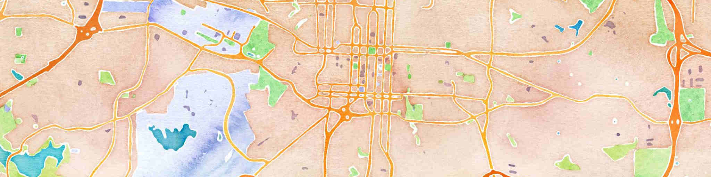



<h2>Spectacular Mountain</h2>

  
    
  

<!--'None'-->
<!---->
<!--  {{ post.date | date: '%Y' }}-->
<!--  -->
<!--    <h2 id="{{ year | slugify }}" class="archive__subtitle">{{ year }}</h2>-->
<!--    {{ year }}-->
<!--  -->
<!--  -->
<!---->
